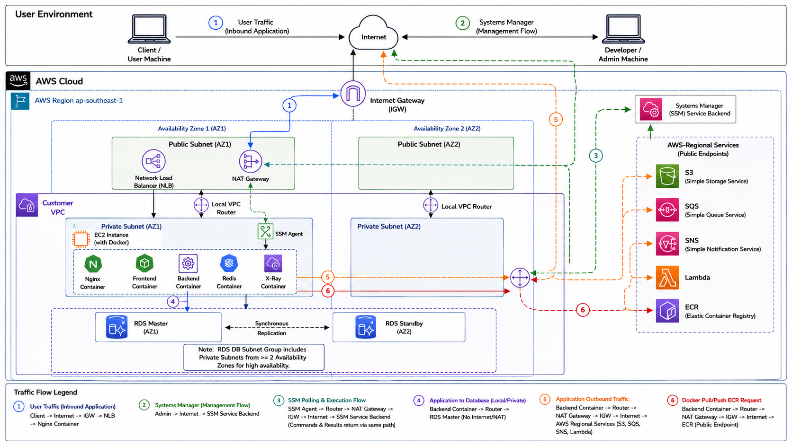
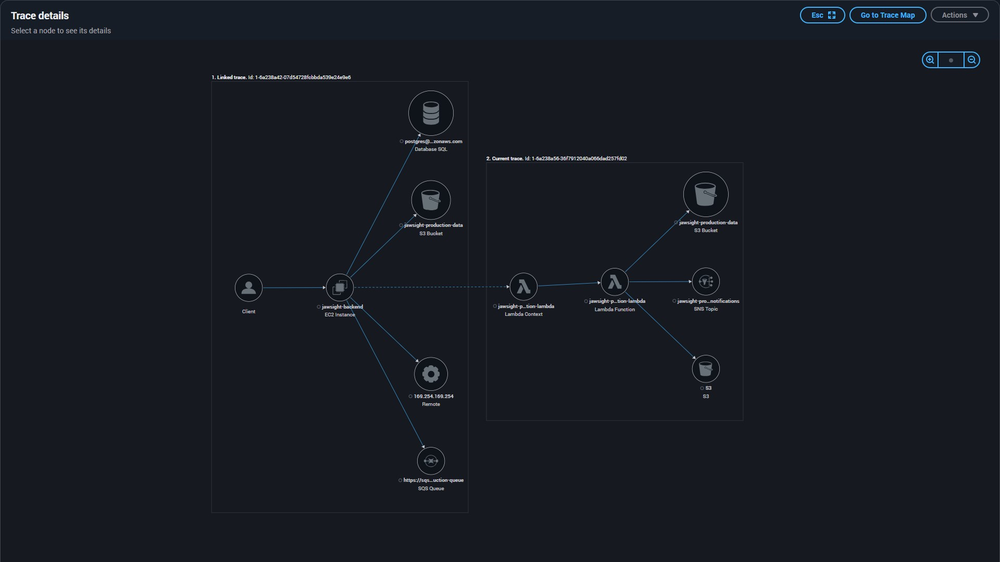

# JawSight ☁️ AWS Architecture

A full-stack web app where doctors upload patient photos (front, left, right) and an AI pipeline processes them into jaw images. The app runs on **AWS**, is provisioned with **Terraform**, sits behind a **custom domain with HTTPS**, and deploys automatically with **GitHub Actions**.

This README focuses on the **cloud architecture and DevOps** side of the project.

**Tech:** React + TypeScript (Vite) · Node.js/Express · PostgreSQL · Python (PyTorch/ONNX) · Docker · Terraform · GitHub Actions

## Architecture



| Layer | AWS service | Why |
|---|---|---|
| Entry point | **Network Load Balancer** | Public entry in the public subnet. Terminates HTTPS |
| Compute | **EC2 in a private subnet** | Runs Docker Compose: Nginx, frontend, backend, Redis, X-Ray daemon |
| Database | **RDS PostgreSQL** | Private subnets only, reachable only from the EC2 security group |
| AI processing | **SQS → Lambda (container image)** | Async, so slow ML jobs never block the API. Failed jobs go to a **dead-letter queue** |
| Storage | **S3** | Patient images, generated results, deployment artifacts |
| Notifications | **SNS** | Lambda publishes "done" → HTTPS webhook to the backend → Socket.IO pushes it live to the browser |
| Images | **ECR** | Backend, frontend, migrations and Lambda images |
| Remote access | **SSM Session Manager / Run Command** | No SSH, no open port 22, no bastion host |
| Egress | **NAT Gateway** | Private instance can reach AWS services and the internet, but is not reachable from it |
| Tracing | **AWS X-Ray** | Request tracing across backend and Lambda |
| Infra as code | **Terraform** | Modules for networking, compute, storage, messaging, IAM. `dev` and `prod` environments |

### How a request flows

1. The user opens `https://www.jawsight.online`, which is a purchased domain pointing at the NLB.
2. The **NLB terminates TLS** using an **ACM certificate** (port 443).
3. It forwards plain TCP to **Nginx** on the EC2 instance, with **Proxy Protocol v2** so the real client IP is kept.
4. **Nginx** routes `/api` and `/socket.io` to the backend, and everything else to the frontend.
5. The backend saves the images to **S3** and queues a job in **SQS**.
6. **Lambda** picks up the job, generates the images, writes them to S3 and publishes to **SNS**.
7. SNS calls the backend webhook, and the backend pushes the result to the browser over **WebSockets**.

### Design decisions worth noting

- **TLS terminates at the NLB, not at Nginx.** The `443` listener is an NLB **TLS listener** (`protocol = "TLS"`) with an ACM certificate attached. The NLB decrypts and forwards **plain TCP** to Nginx on port 80 — Nginx never handles certificates. This only works end-to-end because of a few things working together: the ACM cert is issued in the same region as the NLB and covers the domain, **Proxy Protocol v2** is enabled on the target group (`proxy_protocol_v2 = true`) so the real client IP survives past a Layer-4 load balancer, and Nginx is configured to read it (`listen 80 proxy_protocol;` + `set_real_ip_from`). The EC2 security group only accepts port 80 from inside the VPC, so port 80 is never reachable from the public internet directly.
- **Nothing is public except the NLB.** The server and database are in private subnets. Security groups only allow: NLB → EC2 (port 80), and EC2 → RDS (port 5432).
- **Queue-based ML pipeline.** SQS buffers spikes, the visibility timeout is set above the Lambda timeout, and `maxReceiveCount` + a DLQ prevent endless retries. Lambda reports partial batch failures instead of failing the whole batch.
- **No SSH.** Deployments and admin access go through SSM.

### End-to-end tracing (AWS X-Ray)

Every request is traced across services — EC2 → S3 / RDS / SQS, and the linked Lambda → SNS / S3 trace it triggers:



## CI/CD (GitHub Actions)

Every push to `main` triggers the workflows in [`.github/workflows`](.github/workflows):

**App deploy** ([`fronted_and_backend.yaml`](.github/workflows/fronted_and_backend.yaml))
1. Detects which folders changed (`frontend`, `backend`, migrations, infra), so only what changed is rebuilt
2. Builds Docker images, tags them with the **commit SHA**, and pushes to **ECR**
3. Patches `docker-compose.prod.yml` with the new image tags and uploads it to **S3**
4. Uses **SSM Run Command** to make the private EC2 instance pull from S3 and ECR and run `docker compose up -d`
5. Waits for the result and fails the pipeline if the deployment fails

**Lambda deploy** ([`lambda-deploy.yaml`](.github/workflows/lambda-deploy.yaml)): builds the Lambda container image, pushes to ECR and updates the function code.

S3 works as the "middleman" so that a server with no public IP and no SSH can still be deployed to.

## Terraform layout

```
terraform/
  modules/
    networking/   VPC, subnets, NAT, NLB, security groups
    compute/      EC2, Lambda
    storage/      RDS, S3, ECR
    messaging/    SQS (+ DLQ), SNS, subscriptions
    iam/          roles and users
  environments/
    dev/  prod/
```

## Bonus: Kubernetes internal load balancing (study notes)

The ML service was originally planned to run on Kubernetes, but I moved it to EC2 + Lambda instead since running a cluster (EKS or self-managed) was too costly for this project. Before making that call, I mapped out how Kubernetes load-balances traffic **inside** a cluster — this diagram is those study notes, not part of the deployed architecture above.


It covers:
- How a **Service** gets a stable ClusterIP, and how **CoreDNS** resolves the service name to it
- How **kube-proxy** watches **EndpointSlices** and writes **iptables** rules, so **netfilter** picks a pod using probability-based rules
- What happens when the **HPA** scales pods up (metrics server → HPA → ReplicaSet controller → scheduler → kubelet → EndpointSlice update)

## Project structure

```
frontend/    React + TypeScript app (Nginx container)
backend/     Express API, Socket.IO, Sequelize
sequelizer/  Database migrations (own Docker image)
lambda/      Python image-processing function (container image)
terraform/   Infrastructure as code
nginx.conf   Reverse proxy (HTTP + Proxy Protocol behind the NLB)
docker-compose.prod.yml
screenshots/ Architecture diagrams used in this README
```

## Author

Pasindu Miniruwan Wickramarathna
